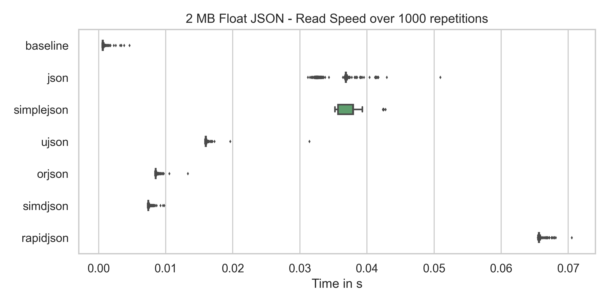
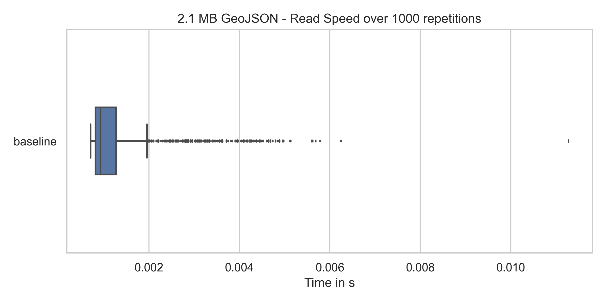
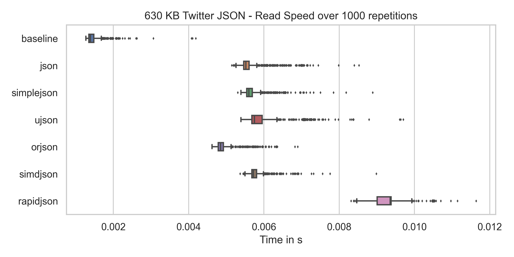
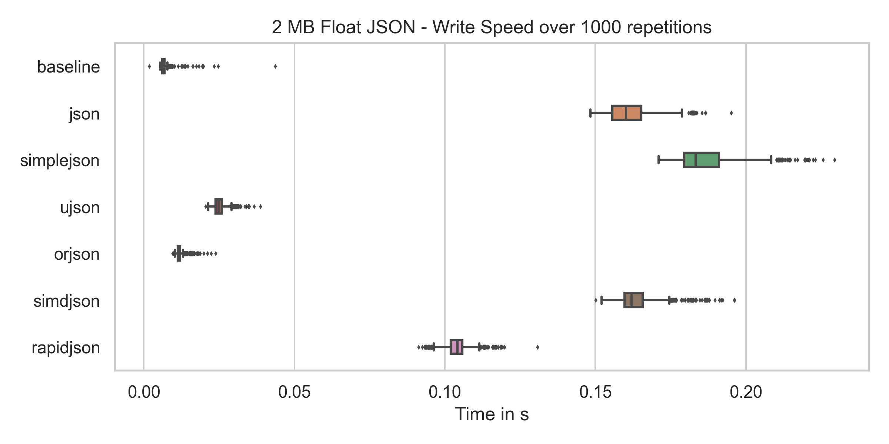
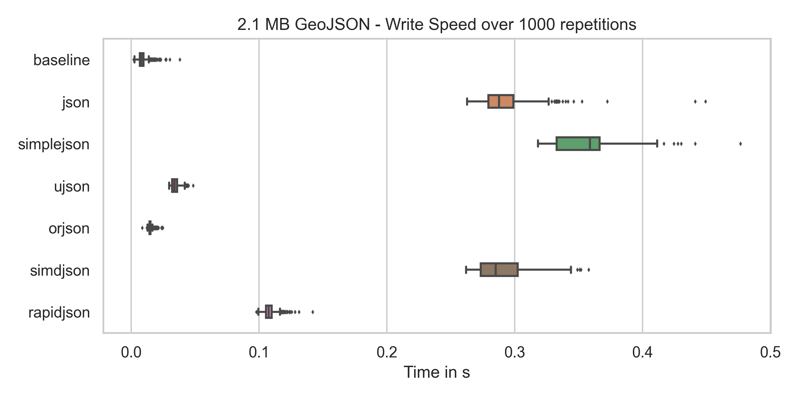
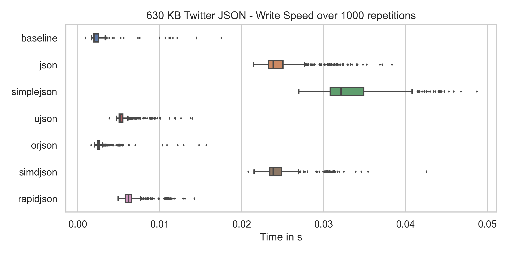

# Comparison of JSON packages in Python

Python has a couple of packages which parse / dump JSON for you. Here is a
comparison of them. The dates are as of 2020-09-26 07:00+00:00:

<table>
    <tr>
        <th></th>
        <th>cPython JSON</th>
        <th>simplejson</th>
        <th>ujson</th>
        <th>orjson</th>
        <th>pysimdjson</th>
        <th>python-rapidjson</th>
    </tr>
    <tr>
        <th>License</th>
        <td>Python Software Foundation License</td>
        <td>MIT / Academic Free License (AFL)</td>
        <td>BSD License</td>
        <td>MIT / Apache</td>
        <td>MIT</td>
        <td>MIT</td>
    </tr>
    <tr>
        <th colspan="7">Maturity</th>
    </tr>
    <tr>
        <th>Version</th>
        <td>3.8.6</td>
        <td>3.17.2</td>
        <td>3.2.0</td>
        <td>3.4.0</td>
        <td>3.0.0</td>
        <td>0.9.1</td>
    </tr>
    <tr>
        <th>Development Status</th>
        <td></td>
        <td>Production/Stable</td>
        <td>Production/Stable</td>
        <td>Production/Stable</td>
        <td style="background-color: red;">Alpha</td>
        <td style="background-color: red;">Alpha</td>
    </tr>
    <tr>
        <th>GH First release</th>
        <td>1993-01-10</td>
        <td>2006-01-01</td>
        <td>2012-06-18</td>
        <td>2018-11-23</td>
        <td>2019-02-23</td>
        <td>2017-03-02</td>
    </tr>
    <tr>
        <th>CI-Pipeline</th>
        <td>GH, Travis, Azure</td>
        <td>GH, Travis, Appveyor</td>
        <td>GH, Travis</td>
        <td>Azure</td>
        <td>GH, Travis</td>
        <td>Appveyor</td>
    </tr>
    <tr>
        <th colspan="7">Operational Safety</th>
    </tr>
    <tr>
        <th>GH Organization</th>
        <td>✓</td>
        <td>✓</td>
        <td>✓</td>
        <td>✗</td>
        <td>✗</td>
        <td>✓</td>
    </tr>
    <tr>
        <th>GH Contributors</th>
        <td>1319</td>
        <td>30</td>
        <td>50</td>
        <td>9</td>
        <td>7</td>
        <td>15</td>
    </tr>
    <tr>
        <th>Last release</th>
        <td>2020-09-23</td>
        <td>2020-07-16</td>
        <td>2020-09-08</td>
        <td>2020-09-25</td>
        <td>2020-08-21</td>
        <td>2019-11-13</td>
    </tr>
    <tr>
        <th>Last Commit</th>
        <td>2020-09-25</td>
        <td>2020-07-16</td>
        <td>2020-09-19</td>
        <td>2020-09-25</td>
        <td>2020-08-31</td>
        <td>2020-05-08</td>
    </tr>
    <tr>
        <th>PyPI Maintainers</th>
        <td></td>
        <td>3</td>
        <td>4</td>
        <td style="background-color: red;">1</td>
        <td style="background-color: red;">1</td>
        <td>2</td>
    </tr>
    <tr>
        <th colspan="7">Users</th>
    </tr>
    <tr>
        <th>GH Stars</th>
        <td>33,700</td>
        <td>1310</td>
        <td>2966</td>
        <td>1348</td>
        <td>374</td>
        <td>397</td>
    </tr>
    <tr>
        <th>GH Forks</th>
        <td>16,200</td>
        <td>290</td>
        <td>306</td>
        <td>48</td>
        <td>25</td>
        <td>31</td>
    </tr>
    <tr>
        <th>GH Used By</th>
        <td>-</td>
        <td>47,164</td>
        <td>14,760</td>
        <td>613</td>
        <td>11</td>
        <td>661</td>
    </tr>
    <tr>
        <th>StackOverflow Questions</th>
        <td></td>
        <td><a href="https://stackoverflow.com/questions/tagged/simplejson">279</a></td>
        <td><a href="https://stackoverflow.com/questions/tagged/ujson">6</a></td>
        <td><a href="https://stackoverflow.com/questions/tagged/orjson">3</a></td>
        <td>-</td>
        <td><a href="https://stackoverflow.com/questions/tagged/rapidjson">319</a></td>
    </tr>
    <tr>
        <th colspan="7">Benchmarks</th>
    </tr>
    <tr>
        <th>GeoJSON Read</th>
        <td>48ms</td>
        <td>45ms</td>
        <td style="background-color: green;">22ms</td>
        <td style="background-color: green;">19ms</td>
        <td style="background-color: green;">14ms</td>
        <td style="background-color: red;">83ms</td>
    </tr>
    <tr>
        <th>GeoJSON Write</th>
        <td>291ms</td>
        <td style="background-color: red;">352ms</td>
        <td style="background-color: green;">34ms</td>
        <td style="background-color: green;">15ms</td>
        <td>289ms</td>
        <td style="background-color: green;">108ms</td>
    </tr>
    <tr>
        <th>Twitter Read</th>
        <td>6ms</td>
        <td>6ms</td>
        <td>6ms</td>
        <td>5ms</td>
        <td>6ms</td>
        <td style="background-color: red;">9ms</td>
    </tr>
    <tr>
        <th>Twitter Write</th>
        <td>25ms</td>
        <td style="background-color: red;">33ms</td>
        <td style="background-color: green;">5ms</td>
        <td style="background-color: green;">3ms</td>
        <td>24ms</td>
        <td style="background-color: green;">6ms</td>
    </tr>
    <tr>
        <th>2MB Float List Read</th>
        <td>36ms</td>
        <td>37ms</td>
        <td style="background-color: green;">16ms</td>
        <td style="background-color: green;">9ms</td>
        <td style="background-color: green;">7ms</td>
        <td style="background-color: green;">66ms</td>
    </tr>
    <tr>
        <th>2MB Float List Write</th>
        <td>161ms</td>
        <td style="background-color: red;">186ms</td>
        <td style="background-color: green;">25ms</td>
        <td style="background-color: green;">12ms</td>
        <td style="background-color: red;">164ms</td>
        <td>104ms</td>
    </tr>
</table>

## Speed Plots

### Read
* The baseline for reading is just reading the text file as text.

### Write
* The baseline for writing is dumping the JSON as text (converted to text before)

## Further Information

* [UltraJSON](https://github.com/ultrajson/ultrajson) is a C library. `ujson` is a binding to it.
* [simdjson](https://github.com/simdjson/simdjson) is a C++ library with funding from Canada. `pysimdjson` is a binding to it.
* [Rapidjson](https://github.com/Tencent/rapidjson) is a C++ library developed by [Tencent](https://en.wikipedia.org/wiki/Tencent). `python-rapidjson` is a binding to it.

## Links

* [cPython](https://github.com/python/cpython/tags)
* [simplejson](https://pypi.org/project/simplejson/) / [GitHub](https://github.com/simplejson/simplejson) / [Question for Feedback](https://github.com/simplejson/simplejson/issues/267)
* [ujson](https://pypi.org/project/ujson/) / [GitHub](https://github.com/ultrajson/ultrajson) / [Question for Feedback](https://github.com/ultrajson/ultrajson/issues/428)
* [orjson](https://pypi.org/project/orjson/) / [GitHub](https://github.com/ijl/orjson) / [Question for Feedback](https://github.com/ijl/orjson/issues/127)
* [pysimdjson](https://pypi.org/project/pysimdjson/) / [GitHub](https://github.com/TkTech/pysimdjson) / [Question for Feedback](https://github.com/TkTech/pysimdjson/issues/54)
* [python-rapidjson](https://pypi.org/project/python-rapidjson/) / [GitHub](https://github.com/python-rapidjson/python-rapidjson) / [Question for Feedback](https://github.com/python-rapidjson/python-rapidjson/issues/140)
